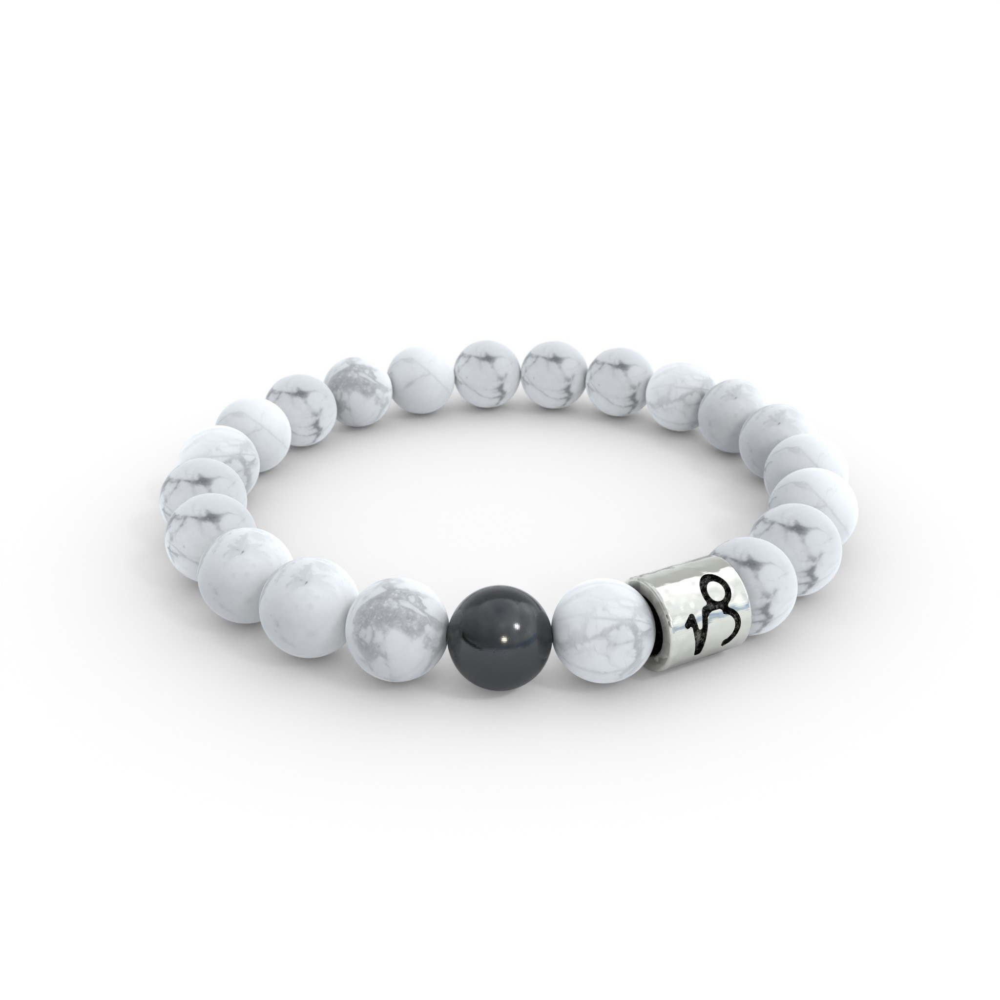
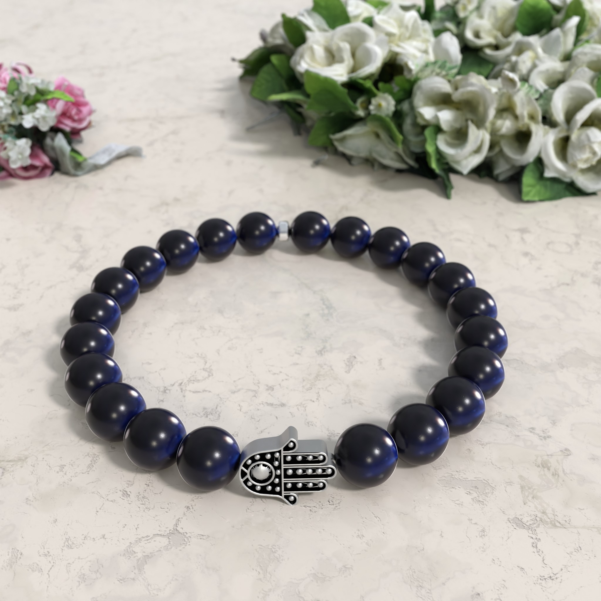
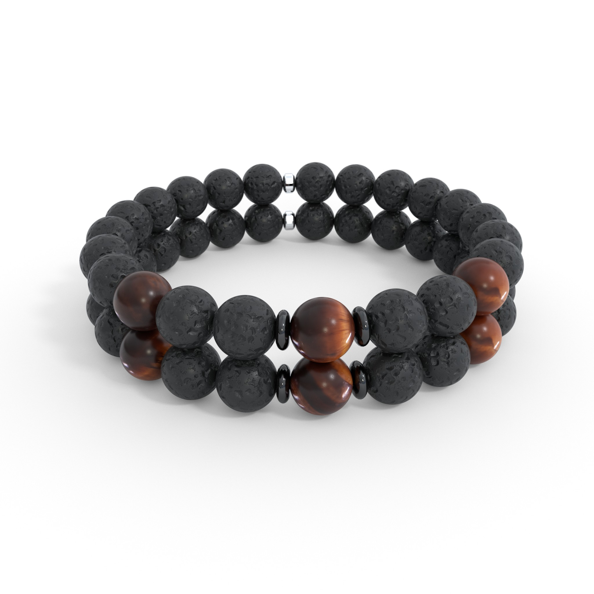

# 3D Bracelet Render Image Generator
A script for generating photo-realistic renders of bead bracelets. This images are used in a real webshop with customers and the bracelets can be bought (shipping only to Hungary) on https://www.elenora.hu (not active anymore)
Some of the bead textures are photographed and cropped by hand, but the newer ones are done using custom Blender procedural texture. The charms and pendants are also modelled by me, with the help of my brother who is a mechanical engineer. 

## Features
- pair bracelets (actually any number of bracelets can be fit in a single image)
- photo-realism (most of my friends couldn't tell that there are renders)
- images can be generated with a background as well

## Here are a few examples of what is possible:

